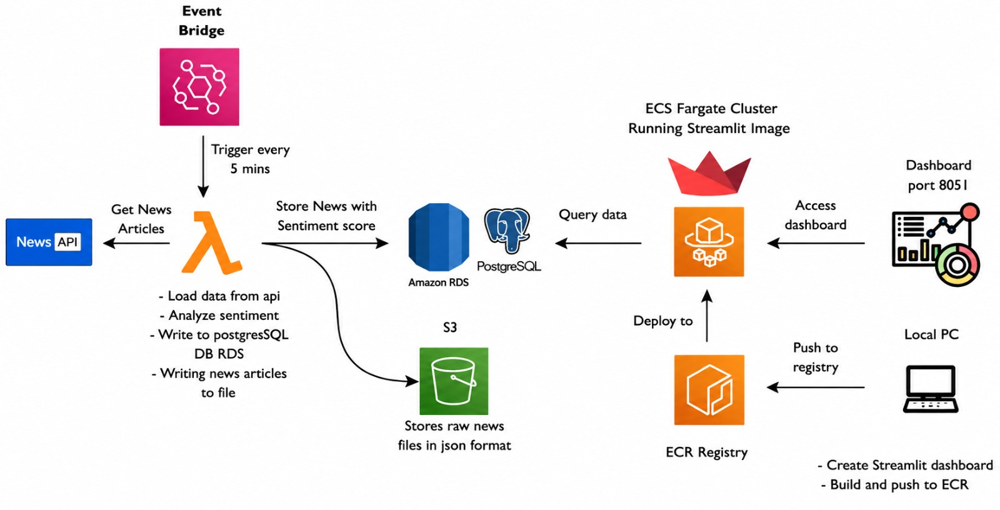

# News Sentiment Platform

## Project Overview

The News Sentiment Platform is a cloud-native data analytics solution that automatically collects real-time news headlines from NewsAPI, performs sentiment analysis using TextBlob, stores processed data in Amazon RDS PostgreSQL, archives raw data in Amazon S3, and visualizes insights through a Streamlit dashboard.

The application is containerized using Docker, stored in Amazon ECR, and executed as an Amazon ECS Fargate task on a scheduled basis using Amazon EventBridge.

---

## Architecture
e



---


```text
EventBridge (Every 5 Minutes)
                │
                ▼
      Amazon ECS Fargate Task
                │
                ▼
         Docker Container
                │
                ▼
            NewsAPI
                │
                ▼
   TextBlob Sentiment Analysis
                │
        ┌───────┴────────┐
        ▼                ▼
Amazon RDS         Amazon S3
(PostgreSQL)      (JSON Storage)
        │
        ▼
 Streamlit Dashboard
```

---

## Features

* Automated news collection every 5 minutes
* Real-time sentiment analysis using TextBlob
* Containerized application using Docker
* Image storage and deployment using Amazon ECR
* Serverless container execution using ECS Fargate
* Event-driven scheduling with Amazon EventBridge
* Data storage in Amazon RDS PostgreSQL
* Raw JSON archival in Amazon S3
* Interactive analytics dashboard using Streamlit
* Fully cloud-based architecture

---

## Technologies Used

### Cloud Services

* AWS EventBridge
* Amazon ECS Fargate
* Amazon ECR
* Amazon RDS PostgreSQL
* Amazon S3
* IAM

### Programming Language

* Python

### Python Libraries

* requests
* pg8000
* boto3
* textblob
* streamlit
* pandas
* plotly

### Containerization

* Docker

### Data Source

* NewsAPI

---

## Workflow

### Step 1: Event Scheduling

Amazon EventBridge triggers the ECS Fargate task every 5 minutes.

### Step 2: Container Execution

ECS pulls the latest Docker image from Amazon ECR and starts the container.

### Step 3: Data Collection

The application fetches current news headlines from NewsAPI.

### Step 4: Sentiment Analysis

TextBlob analyzes the title and description of each article and generates a sentiment score.

### Step 5: Database Storage

Processed news records are inserted into Amazon RDS PostgreSQL.

### Step 6: Data Archival

The processed dataset is saved as JSON files in Amazon S3.

### Step 7: Visualization

The Streamlit dashboard reads data from PostgreSQL and displays:

* Sentiment distribution
* Positive vs Negative news
* Average sentiment trends
* Recent news headlines
* Historical analysis

---

## Database Schema

### Table: news_articles

| Column          | Data Type          |
| --------------- | ------------------ |
| id              | SERIAL PRIMARY KEY |
| title           | TEXT               |
| description     | TEXT               |
| published_at    | TEXT               |
| sentiment_score | FLOAT              |
| created_at      | TIMESTAMP          |

---

## AWS Services Used

### Amazon EventBridge

Schedules the application to run automatically every 5 minutes.

### Amazon ECS Fargate

Executes the Docker container without managing servers.

### Amazon ECR

Stores Docker images securely.

### Amazon RDS PostgreSQL

Stores processed news and sentiment scores.

### Amazon S3

Stores archived JSON files for historical analysis.

### IAM

Provides secure permissions between AWS services.

---

## Environment Variables

```text
NEWS_API_KEY
DB_HOST
DB_NAME
DB_USER
DB_PASSWORD
BUCKET_NAME
```

---

## Docker Workflow

```text
Application Code
        │
        ▼
Docker Build
        │
        ▼
Docker Image
        │
        ▼
Amazon ECR
        │
        ▼
Amazon ECS Fargate
        │
        ▼
Scheduled by EventBridge
```

---

## Dashboard Features

The Streamlit dashboard provides:

* Total Articles Processed
* Positive News Count
* Negative News Count
* Neutral News Count
* Sentiment Trend Analysis
* News Search and Filtering
* Interactive Charts

---

## Business Benefits

* Automated data collection
* Real-time sentiment monitoring
* Scalable cloud architecture
* Low operational cost
* Historical data retention
* Easy deployment and maintenance

---

## Future Enhancements

* Multi-country news collection
* AI-based sentiment models
* Topic classification
* Real-time alerts
* Power BI integration
* Predictive analytics
* Machine learning sentiment scoring

---

## Author

Ashwin CV

BCA Graduate

Cloud Data Analytics Intern

Expertz Lab, Palarivattom

---

## Conclusion

This project demonstrates a complete cloud-native data engineering and analytics workflow using Docker, Amazon ECR, Amazon ECS Fargate, EventBridge, RDS PostgreSQL, S3, Streamlit, and Python. The platform automates news ingestion, sentiment analysis, data storage, and visualization in a scalable and production-ready architecture.
